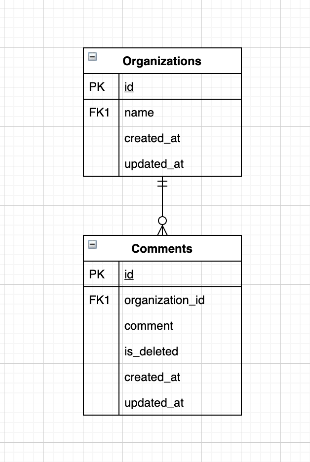

# ORGS-COMMENTS

*ORGS-COMMENTS* is the codebase for organization's comment related API

This application is deployed to AWS Lambda. You can access the endpoints with this base url
`https://djxm0or2qd.execute-api.us-east-1.amazonaws.com/dev`

## App Stack

```
nodejs + express
mongodb (hosted in mlab)
```

## Prerequisite
- node version >= 8.0
- npm
- docker (if you wanted to run this app locally via docker)

## Run Application
```
npm install
npm run launch:app
```

OR via *Docker*

```
docker build -t orgs-comments .
docker run --name orgs-comments  -p <YOUR_PORT>:9000 -d orgs-comments
```

and to stop

```
docker stop orgs-comments
```

## Run Test
Test defined into 3 parts, they are E2E, integration, and unit test
- To run all tests :
```
npm run test
```
- To run E2E tests only :
```
npm run test:e2e
```

## Database ERD

The database for this codebase defined in this diagram :



When request to add comment for certain organization come, it will look to the `Organizations` collection first based on the organization name from request param.
It will do the upsert action for organization, if the organization exist, then it will just return the `organization_id`, else it will create new organization and return its id. Then the comment will be stored with that given `organization_id`

## API List

If you run this app on your local, the `base-url` will be `http://localhost:9000`  by default, unless you overwrite the `PORT` env in the `.env` file or the port that you specify in <YOUR_PORT> when you run the app via *Docker*

### Add Comment

Use this endpoint to add new comment for the organization in the request param

```
POST {{base-url}}/orgs/:organization_name/comments
```

Request Body example
```
{
	"comment": "Test Add New Comment"
}
```

Request example : 
```
curl -X GET \
  http://localhost:9000/orgs/test-NewOrgz/comments \
  -H 'Content-Type: application/json' \
  -H 'cache-control: no-cache' \
  -d '{
	"comment": "Test Add New Comment"
   }'
```

Successful Response example :
```
{
    "comment": "Test Add New Comment",
    "created": "2020-04-18T13:41:24.389Z",
    "updated": "2020-04-18T13:41:24.389Z",
    "id": "5e9b0384b83c1128516eb6c8"
}
```

Failed Response example :
```
{
    code: 'UNKNOWN_ERROR',
    message: 'Server Error'
}
```

### Get Organization's Comment

*NOTE:* If you are accessing this endpoint through deployed app in serverless, and you happen to use postman, please make sure to set the request body to the `none`. Or you'll get `Bad Request` error

Use this endpoint to get list of comments for the organization in the request param

```
GET {{base-url}}/orgs/:organization_name/comments
```

Request example :
```
curl -X GET \
  http://localhost:9000/orgs/test-NewOrgz/comments \
  -H 'Content-Type: application/json' \
  -H 'cache-control: no-cache'
```

Successful Response example :
```
{
    "organization_name": "test-NewOrgz",
    "comments": [
        {
            "comment": "Test Add New Comment",
            "created": "2020-04-18T14:30:16.464Z",
            "updated": "2020-04-18T14:30:16.464Z",
            "id": "5e9b0ef8a87eaf291c3a370b"
        },
        {
            "comment": "Test Add Another New Comment",
            "created": "2020-04-18T14:30:23.070Z",
            "updated": "2020-04-18T14:30:23.070Z",
            "id": "5e9b0effa87eaf291c3a370c"
        }
    ]
}
```

Failed Response example :
```
{
    "code": "ORGANIZATION_NOT_FOUND_ERROR",
    "message": "Organization not found!"
}
```

### Delete Organization's Comment

Use this endpoint to remove all comments comments for the organization in the request param.
This endpoint will only perform `soft delete` so the data will still remain in the database

```
DELETE {{base-url}}/orgs/:organization_name/comments
```

Request example :
```
curl -X DELETE \
  http://localhost:9000/orgs/test-NewOrgz/comments \
  -H 'Content-Type: application/json' \
  -H 'cache-control: no-cache'
```

Successful Response example :
```
{
    "success": true
}
```

Failed Response example :
```
{
    "code": "ORGANIZATION_NOT_FOUND_ERROR",
    "message": "Organization not found!"
}
```